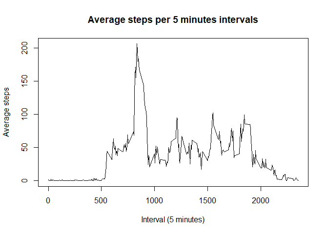

**Introduction**
----------------

This assignment makes use of data from a personal activity monitoring
device. This device collects data at 5 minute intervals through out the
day. The data consists of two months of data from an anonymous
individual collected during the months of October and November, 2012 and
include the number of steps taken in 5 minute intervals each day.

**Files**
---------

-   [GitHub
    Repository](https://github.com/lmorenon/RepData_PeerAssessment1)

**Libraries**
-------------

    library(readr)
    library(dplyr)
    library(tidyr)
    library(lattice)
    library(rmarkdown)
    library(knitr)
    library(lubridate)
    library(prettydoc)

Loading and preprocessing the data
----------------------------------

1.  Download or fork/import the [GitHub
    Repository](https://github.com/lmorenon/RepData_PeerAssessment1) and
    load the *activity.zip* file in your R enviroment

<!-- -->

    DB_activity <- read_csv("activity.zip")
    Sys.setlocale("LC_TIME", "English")

1.  Add group variables

<!-- -->

    days <- weekdays(DB_activity$date)
    DB_activity <- cbind(DB_activity,days)

What is mean total number of steps taken per day?
-------------------------------------------------

1.  Histogram of the total number of steps taken each day

<!-- -->

    steps_day <- DB_activity %>% group_by(date) %>% summarise(steps_per_day = sum(steps,na.rm=TRUE))
        

    hist(steps_day$steps_per_day,main = "Total Steps taken per day", 
         xlab = "Steps per day")

2.Calculate and report the mean and median of the total number of steps
taken per day

    mean_steps<-mean(steps_day$steps_per_day)
    median_steps<-median(steps_day$steps_per_day, na.rm = TRUE)

The mean number of steps taken per day is 9354.2295082. The median steps
taken per day is 1.039510^{4}.

What is the average daily activity pattern?
-------------------------------------------

1.  Make a time series plot (i.e. type = “l”) of the 5-minute interval
    (x-axis) and the average number of steps taken, averaged across all
    days (y-axis)

<!-- -->

    average_activity <- DB_activity %>% group_by(interval) %>% 
         summarise(avg_activity = mean(steps,na.rm=TRUE))

    plot(average_activity$interval, 
         average_activity$avg_activity, type = "l", xlab="Interval (5 minutes)", 
         ylab="Average steps", main="Average steps per 5 minutes intervals")

1.  Which 5-minute interval, on average across all the days in the
    dataset, contains the maximum number of steps?

<!-- -->

    Max_steps <- average_activity[which.max(average_activity$avg_activity),1]
    print(as.vector(Max_steps))

    ## # A tibble: 1 x 1
    ##   interval
    ##      <dbl>
    ## 1      835

The 5-minute interval, on average across all the days in the
dataset,that contains the maximum number of steps is 835.

Imputing missing values
-----------------------

1.  Calculate and report the total number of missing values in the
    dataset (i.e. the total number of rows with NAs)

<!-- -->

    NAs<-sum(is.na(DB_activity$steps))
    NAs

    ## [1] 2304

The number of missing values in the dataset is 2304.

1.  Devise a strategy for filling in all of the missing values in the
    dataset

**Imputate Method: Average steps (5 min-intervals) per day replaces
NAs**

    steps_impute <- average_activity$avg_activity[match(DB_activity$interval,
                                                        average_activity$interval)]

    DB_act_imputate <-transform(DB_activity, 
                                steps = ifelse(is.na(DB_activity$steps), 
                                yes = steps_impute, no = DB_activity$steps))
    steps_day_imp <- DB_act_imputate %>% group_by(date) %>% 
                     summarise(steps_per_day = sum(steps))

New dataset whitout NAs: **DB\_act\_imputate**

1.  Make a histogram of the total number of steps taken each day and
    Calculate and report the mean and median total number of steps taken
    per day.

<!-- -->

    hist(steps_day_imp$steps_per_day,main = "Total Steps taken per day (Replaced NAs)", 
         xlab = "Steps per day")

    mean_steps_replacedNAs<-mean(steps_day_imp$steps_per_day)

    meadian_steps_replacedNAs<-median(steps_day_imp$steps_per_day,na.rm = TRUE)

The mean number of steps with replaced NAs, taken per day is
1.076618910^{4}. The median steps with replaced NAs, taken per day is
1.076618910^{4}.

-   Do these values differ from the estimates from the first part of the
    assignment?

<!-- -->

    t.test(steps_day$steps_per_day,steps_day_imp$steps_per_day)

    ## 
    ##  Welch Two Sample t-test
    ## 
    ## data:  steps_day$steps_per_day and steps_day_imp$steps_per_day
    ## t = -1.6436, df = 110.2, p-value = 0.1031
    ## alternative hypothesis: true difference in means is not equal to 0
    ## 95 percent confidence interval:
    ##  -3114.4271   290.5088
    ## sample estimates:
    ## mean of x mean of y 
    ##   9354.23  10766.19

The **Welch Two Sample t-test** reveals that the original and imputated
datasets **don’t differ** at **p &lt; 0.05**.

-   What is the impact of imputing missing data on the estimates of the
    total daily number of steps?  
    The impact of imputing missing data on the estimates of the total
    daily number of steps reflects in two ways:
    -   **skew the data**: Reduces the variability of the measures
        (depends of sample size).
    -   **Data Accuracy**: The impute data possibly doesn’t represent
        the true values found in the reality.

Are there differences in activity patterns between weekdays and weekends?
-------------------------------------------------------------------------

1.  Create a new factor variable in the dataset with two levels –
    “weekday” and “weekend” indicating whether a given date is a weekday
    or weekend day.

<!-- -->

    DB_act_days <- DB_activity %>% mutate(weekdays= ifelse(days=="Saturday" | 
                                          days=="Sunday", "Weekend", "Weekday"))
    DB_act_days$weekdays <-  as.factor(DB_act_days$weekdays)

1.  Make a panel plot containing a time series plot (i.e. type = “l”) of
    the 5-minute interval (x-axis) and the average number of steps
    taken, averaged across all weekday days or weekend days (y-axis).

<!-- -->

    avg_steps_daytype <- DB_act_days %>% group_by(weekdays,interval) %>%  
                        summarise(avg_steps=mean(steps,na.rm = TRUE))

    with(avg_steps_daytype, 
         xyplot(avg_steps ~ interval | weekdays, 
                type = "l",      
                main = "Average Steps per Intervals by dayType",
                xlab = "Daily Intervals",
                ylab = "Average Steps"))

------------------------------------------------------------------------

**Thanks for review me**  
**This project was developed in the context of the course “Reproducible
Research” from Coursera**
